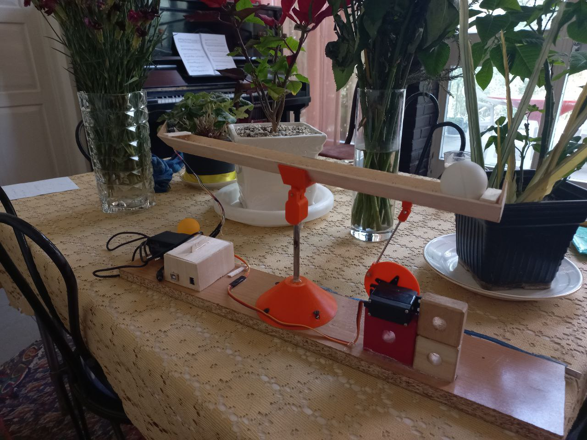

# PID-ball-balance

this repository contain 3D cads, codes and arduino schematics for makinh 3d PID balance project.



# list of objects used for the project
* Ardoino Uno
* GP2Y0E3 sensor
* Servo motor
* balsa wood


# Repositoty tree
```
.
├── balance_3D_files
│   ├── 6. Small_gear (2x).stl
│   ├── Balanza PID pingpong.blend
│   ├── Base.stl
│   ├── Disc.stl
│   ├── Disc2.stl
│   ├── Disc3.stl
│   ├── End_stop.stl
│   ├── Hinge_1.stl
│   ├── Hinge_2.stl
│   ├── Servo_support.stl
│   ├── Small_hinge_1.stl
│   ├── Small_hinge_2.stl
│   └── Small_hinge_3.stl
├── code
│   ├── GP2Y0E03.zip
│   └── sketch_apr26a.ino
├── photo.jpg
├── poster.pdf
├── sensor scheme.png
```
**you should add *GP2Y0E03.zip* to package list of ardoino IDE**

**in `sensor scheme.png` you can see how to connect the sensor to the board**

# youtube video

[youtube link](https://youtu.be/L-_SZNlJ-wk)

[orginal project clip](https://www.youtube.com/watch?v=JFTJ2SS4xyA&ab_channel=Electronoobs)
